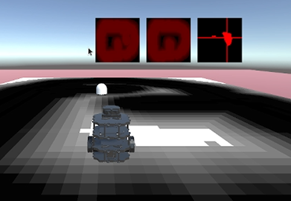

# Structural Integrity Bot
2IRR10 CBL Autonomous Systems Twinning project, team 22.

## Usage guide
Setup and usage:
- [Unity](#unity-setup)
- [Instructions to run](#instructions-to-run)

### Unity setup
Open the project in Unity and open the 'testrealistic' scene in the Scenes folder.
The scripts that read the map and do calculations are attached to the MainCamera GameObject.

### Instructions to run
We assume you have a ros enviroment setup.

1. Run `ros2 run ros_tcp_endpoint default_server_endpoint --ros-args -p ROS_IP:=(insert your ip)` (ros args and ip are unneeded if using docker)
2.`ros2 launch slam_toolbox online_async_launch.py use_sim_time:=True` This is the mapping software, you can use cartographer if you want
3. Play the unity scene.
4. Control the robot with `ros2 run turtlebot3_teleop teleop_keyboard`
5. `ros2 run nav2_map_server map_saver_cli -f ~/map`  to save the map
6. Close the mapping software and run `ros2 launch turtlebot3_navigation2 navigation2.launch.py map:=$HOME/map.yaml`
7. run `ros2 param set /global_costmap/global_costmap inflation_layer.inflation_radius 0.30`
8. drive around until the costmap is fully filled in, then press p in unity to save it.
9. stop the unity simulation and add an obstacle to the enviroment.
10. Start the unity simulation again.
11. restart navigation2, and hold the E key in Unity.
12. the robot should behave correctly.

### Expected Behaviour

The digital twin compares the old baseline map (middle) with the newly scanned map (left) and displays the results in an image (right). 
A capsule has been teleported to the location of the obstacle that has been found in the unity scene. 

## Member list
Members (GitHub usernames):
- Francesca Paraschiv (francesca66)
- Quinten Potma (potmq)
- Nikola Seleš (Nik315)
- Sanula De Silva (Maxawa)
- Kanupriya Singh (KSingh168)
- Bogdan Spătaru (skneww)
- Petar Zhelev (PetarZh123)
